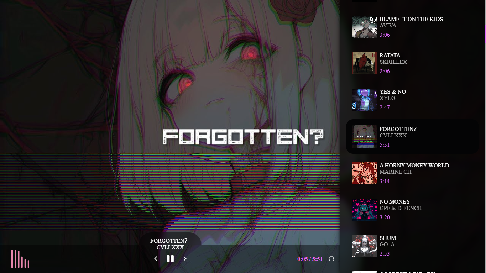

<p align="center">
  
</p>

<h1 align="center">Reproductor de Música en Electron</h1>

<p align="center">
  Este es un reproductor de música de escritorio desarrollado con <a href="https://www.electronjs.org/">Electron</a>, que escanea una carpeta local de archivos `.mp3`, extrae sus metadatos (incluyendo carátulas), y los muestra en una interfaz visual con controles básicos de progreso.
</p>

---

## 📂 Estructura del proyecto

```
📁 your-project/
├── main.js                # Proceso principal (ventana y lógica backend)
├── preload.js             # Comunicación segura entre frontend y backend
├── package.json
├── .gitignore
├── 📁 renderer/
│   ├── index.html         # Interfaz principal del reproductor
│   ├── styles.css         # Estilos de la interfaz
│   ├── script.js          # Lógica del reproductor (frontend)
│   └── 📁 assets/         # Íconos SVG para controles
└── 📁 node_modules/       # Dependencias de Node.js
```

---

## 🚀 Cómo ejecutar el proyecto

1. **Clonar el repositorio:**

```bash
git clone https://github.com/ZomboySoul/Reproductor_Music.git
cd Reproductor_Music
```

2. **Instalar dependencias:**

```bash
npm install
```

3. **Ejecutar la aplicación:**

```bash
npm start
```

> Asegurate de que exista una carpeta con archivos `.mp3` en:  
> `C:/Users/TU_USUARIO/Desktop/music/`  
> _(Podés modificar esta ruta en `main.js` si querés usar otra carpeta.)_

---

## 🧠 Tecnologías utilizadas

- **Electron**: para crear la app de escritorio
- **music-metadata**: para extraer información de los archivos de audio
- **HTML/CSS/JS**: interfaz visual simple y funcional

---

## ✨ Funcionalidades

- ✅ Muestra carátula, título y duración de las canciones
- ✅ Carga automática de nuevos temas según fecha de creación
- ✅ Reproductor con controles básicos (play, pausa, anterior, siguiente)
- ✅ Visualización del progreso en un canvas
- ✅ Shuffle, repeat, y mejoras en la visualización

---

## 🖼️ Vista previa

  

---

## 📦 Dependencias principales

```json
{
  "electron": "^36.2.1",
  "music-metadata": "^11.2.3"
}
```

> Asegurate de actualizar las versiones en `package.json`.

---

## 📄 Licencia

Este proyecto está bajo la licencia [MIT](LICENSE).

---

## 💡 Autor

Desarrollado por [Agustín Lezcano](https://github.com/ZomboySoul) – Argentina 🇦🇷