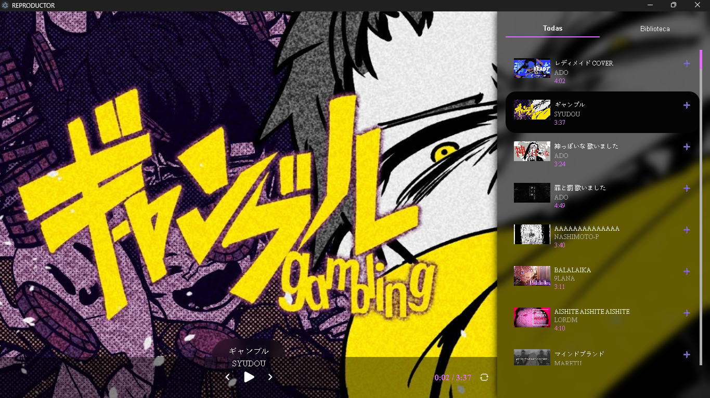
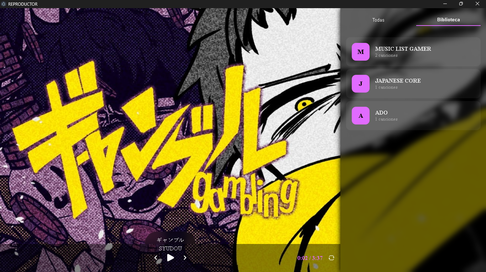
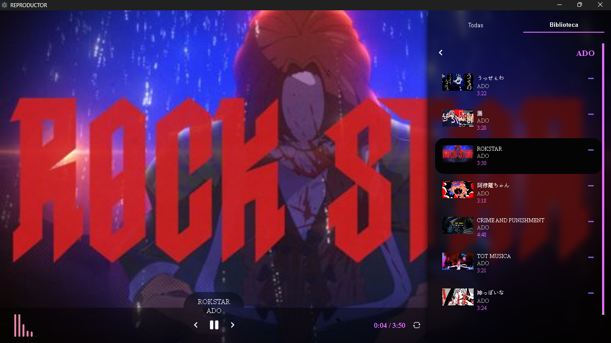

<p align="center">

</p>
<h1 align="center">
Music Player --- Electron Desktop App
</h1>
<p align="center">
A fully visual and customizable desktop music player built with
<a href="https://www.electronjs.org/">Electron</a>.
It scans your local music folder, extracts metadata and album covers,
and displays them in a modern interface with real-time visualization and
playlist management.
</p>

---

## 📂 Project Structure

    📁 your-project/
    ├── main.js               # Main process (window and backend logic)
    ├── preload.js            # Secure bridge between frontend and backend
    ├── package.json
    ├── .gitignore
    ├── 📁 assets/            # App icons and images
    ├── 📁 renderer/
    │   ├── index.html        # Main player interface
    │   ├── styles.css        # UI styles
    │   └── script.js         # Frontend player logic
    └── 📁 node_modules/      # Node.js dependencies

## 🚀 How to Run the Project

1. **Clone the repository:**

```bash
git clone https://github.com/ZomboySoul/Reproductor_Music.git
cd Reproductor_Music
```

2. **Install dependencies:**

```bash
npm install
```

3. **Start the app:**

```bash
npm start
```

> Make sure a folder containing `.mp3` files exists at:
> `C:/Users/YOUR_USERNAME/Desktop/music/`
> *(You can edit this path in `main.js` if you want to use another
> folder.)*

## 💻 Windows Executable (.exe)

You can also download the **ready-to-run .exe version** from the
[Releases](https://github.com/ZomboySoul/Reproductor_Music/releases)
page.
No Node.js installation required --- just download and play your music
instantly.


## 🧠 Tech Stack

- **Electron** -- Desktop application framework\
- **music-metadata** -- Extracts metadata and album covers\
- **HTML / CSS / JavaScript (ES Modules)** -- Frontend logic and
  styling\
- **EJS** *(optional, if used)* -- Dynamic template rendering

## ✨ Key Features (Updated)

- 🎨 **Modern UI:** Redesigned visual interface inspired by Spotify
  and YouTube Music\
- 💿 **Album System:** Create, organize, and view custom music albums\
- 🖱️ **Drag & Drop Playlist:** Reorder your songs easily\
- 🔊 **Visualizer:** Real-time audio visualization synced with
  playback\
- 🧠 **Persistent Data:** Option to save your custom playlist order
  before exiting\
- 🎧 **Basic Controls:** Play, pause, next, previous, shuffle, and
  repeat\
- ⚡ **Automatic Metadata:** Fetches covers, titles, and durations
  from files

## 🖼️ Preview

<center>
    
    
    
</center>

## 📦 Main Dependencies

```json
{
  "electron": "^36.2.1",
  "music-metadata": "^11.2.3"
}
```

> Make sure to keep dependencies up to date in `package.json`.

## 📄 License

This project is licensed under the [MIT License](LICENSE).

## 👤 Author

Developed by [ZomboySoul](https://github.com/Bytech-Technology) ---
Argentina 🇦🇷
